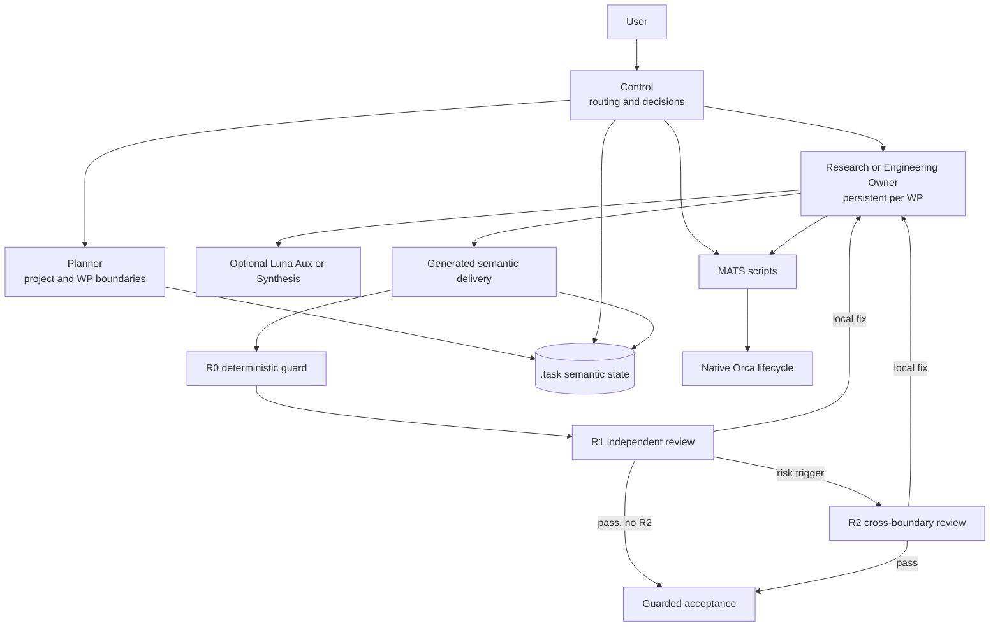

# MATS

MATS (`multi-agent-task-split`) is a Codex Skill for decomposing long-running work, assigning stable roles, and coordinating Orca-managed agents through implementation, review, and acceptance.

Current release: **1.2.0**. MATS uses semantic versioning: the second number is incremented for functional changes, and the third for fixes or small patches. The task-contract schema has its own version (`schema_version: 9`) and is not the product version.

## Setup guide

### Requirements

- Python 3.10 or newer.
- Codex and Orca installed for the same user.
- [`uv`](https://docs.astral.sh/uv/) is preferred for installation and development.
- On Windows, Git Bash is recommended for repository work; the native `.cmd` launcher remains available for Command Prompt and PowerShell.

### Install

Clone this repository:

```bash
git clone https://github.com/SGSGsama/MATS.git
cd MATS
```

On Windows, run:

```bash
./install.cmd
```

From Command Prompt, the same command is:

```bat
install.cmd
```

On macOS or Linux, run the portable installer directly:

```bash
uv run --no-project python installer/install.py
```

The installer:

- copies only `skill/multi-agent-task-split/` to the user's Codex skills directory;
- creates an isolated `.venv` inside the installed Skill;
- installs the pinned Python runtime dependency;
- validates the policy, schema, launchers, and isolated runtime;
- keeps repository-only tests, audits, and release material out of the model-visible Skill.

The default destination is `%USERPROFILE%\.codex\skills\multi-agent-task-split` on Windows and `~/.codex/skills/multi-agent-task-split` on POSIX systems.

Windows example:

```text
%USERPROFILE%\.codex\skills\multi-agent-task-split
```

To use another Codex skills directory:

```bat
install.cmd --skills-dir D:\path\to\.codex\skills
```

POSIX example:

```bash
uv run --no-project python installer/install.py --skills-dir /path/to/.codex/skills
```

### Update an existing installation

Pull the new release and explicitly replace the installed payload:

```bash
git pull
./install.cmd --force
```

On POSIX systems, replace the second command with:

```bash
uv run --no-project python installer/install.py --force
```

The installer updates payload files atomically where possible and retains a verified isolated runtime. Start a **new Codex Control session after every update**; an already-running session does not reload a replaced Skill contract.

### Verify

In Git Bash:

```bash
~/.codex/skills/multi-agent-task-split/bin/mats doctor
```

In Command Prompt or PowerShell:

```bat
%USERPROFILE%\.codex\skills\multi-agent-task-split\bin\mats.cmd doctor
```

A healthy installation reports `version: 1.2.0`, `isolated_runtime: true`, and valid policy/operator configuration. `live_orca_verified: false` is normal: `doctor` is intentionally non-mutating and does not start an agent.

## Usage

### Enable MATS in the current session

Open Codex in the repository you want to work on, then send:

```text
加载 $multi-agent-task-split
```

You may include the actual task in the same message:

```text
加载 $multi-agent-task-split，分析并修复当前项目的连接稳定性问题；本地工作自主完成，需要部署或重启远程服务时先问我。
```

MATS will load its Control contract, attach the current Codex session, inspect only the control information needed for routing, and create the initial plan when the repository has no existing MATS state. You do not need to run bootstrap commands, create packets, select models, calculate hashes, or manage worker terminals.

### Interact after activation

Continue talking to the current Control session in ordinary language. Control owns task routing and keeps the appropriate Owner alive across implementation and review.

| What you want | Example message |
|---|---|
| Add or change product work | `再修复断线重连，并补一个覆盖并发连接的测试。` |
| Provide new evidence | `新日志放在 debug/latest.log，继续定位这个问题。` |
| Continue the current project | `继续自主完成剩余工作。` |
| Ask for progress | `检查目前进度，告诉我正在做什么和还缺什么。` |
| Ask the retained specialist one question | `问 Research：当前证据能否排除分帧错误？只回答这个问题。` |
| Adjust the active Owner directly | `把这条要求发给当前 Owner：只使用新日志作为证据。` |
| Approve an external action | `可以推送新服务端，但不要重启远程进程。` |
| Keep an external action gated | `本地修改和测试自主完成，需要推送、部署或重启时询问。` |

Some important interaction rules:

- A general `继续`, status question, Skill instruction, or lifecycle question is addressed to Control. It is not copied verbatim into a worker prompt.
- Questions already answerable from your message, control state, or a verified semantic summary are answered by Control directly. A bounded domain question that needs new evidence uses a lightweight retained-Owner query; Control does not open raw product material itself. The query creates no candidate, repeats no initialization, and is never sent twice.
- New product requirements, logs, and in-scope corrections normally stay with the existing Owner for that work package. They do not automatically create a new Planner or a fresh Owner.
- To bypass normal routing and send a small adjustment to the currently active Owner, address the Owner explicitly as shown above.
- If required remote evidence is unavailable to a worker, it asks for that exact evidence. It does not invent results or turn the absence into a fake tool failure.
- Pushes, deployments, restarts, destructive changes, and other externally gated actions remain subject to the authority you state.

### While MATS is waiting

You do not need to notify Control when a worker finishes. A valid Control wait watches Orca lifecycle mail and the relevant Dispatch, then resumes on an event or a bounded checkpoint.

MATS distinguishes a real wait from a dead one:

- when a relevant Dispatch is active, event-driven waiting is expected;
- when no relevant Dispatch is active, Control returns to deterministic advancement instead of opening a blind wait;
- when a worker settles without an importable delivery, MATS returns `LIFECYCLE_DELIVERY_MISSING` instead of waiting forever;
- a pure question or escalation is delivered once, while `worker_done` remains pending until its result is safely imported.

### What users should not maintain

Do not manually edit `.task`, rewrite delivery YAML, calculate snapshot hashes, acknowledge Orca event batches, release retained Owners, or repair bindings. These are script-owned transactions. If the public workflow has a real tool gap, Control stops and reports the exact command and error rather than asking you to fabricate internal files.

The only migration entrypoint is an explicit user-directed migration review. Ordinary activation and recovery never invoke legacy migration automatically.

## Architecture design

### Design goals

MATS is designed around four constraints:

1. **Stable responsibility:** each work package has one durable Research or Engineering Owner; review roles do not silently take ownership.
2. **Low model-to-model I/O:** scripts generate transactional contracts, while models exchange semantic decisions, concise findings, and evidence paths.
3. **Recoverable lifecycle:** the Codex session ID is the durable Owner identity; replaceable Orca handles, runtime restarts, and UI labels do not force a fresh session.
4. **Independent acceptance:** worker completion is never acceptance. Candidates pass deterministic R0, independent R1, and risk-triggered R2 before acceptance.

### System overview



Orca remains the authority for Runs, Tasks, Dispatches, terminals, and native lifecycle. MATS owns semantic roles, packets, evidence identity, routing, review requirements, and acceptance.

### Roles and fixed model policy

Models and reasoning effort are resolved by the launcher, not selected by Control or a worker.

| Role | Responsibility | Default binding |
|---|---|---|
| Control | Interpret user intent, route work, advance the state machine | `gpt-5.6-luna`, max |
| Planner | Establish or materially revise project commitments and work packages | `gpt-6-astra`, xhigh |
| Research Owner | Investigation, reverse engineering, focused scripts and research artifacts | `gpt-5.6-terra`, high |
| Engineering Owner | Product implementation, tests, builds, and local validation | `gpt-5.6-terra`, high |
| Luna Aux | Optional high-volume indexing or mechanical extraction | `gpt-5.6-luna`, max |
| R1 | Independent candidate review | `gpt-5.6-terra`, high |
| Synthesis | Resolve a bounded cross-source question | `gpt-5.6-sol`, high |
| R2 | Audit cross-module/global effects that a local R1 may miss | `gpt-5.6-sol`, high |

For a cybersecurity task, a Sol-bound role uses `gpt-daybreak-blue-latest` at the same effort. It falls back to Sol only when Orca explicitly reports that daybreak-blue is unavailable. The normalized native receipt records that fallback.

The fixed policy is defined in [`config/policy.yaml`](skill/multi-agent-task-split/config/policy.yaml). It is consumed by scripts and is not part of Control's normal prompt load.

### Task decomposition and authority

Planner creates coarse work packages with dependencies, scope, acceptance checks, an authority role (`research` or `engineering`), and an optional descriptive specialty. Specialty changes domain framing only; it cannot change model choice, permissions, scope, review, or acceptance.

When an Engineering boundary itself is an architecture decision, Planner may add an interface contract containing exact declarations plus invariants, lifecycle, compatibility, and validation obligations. A `required` contract must be implemented exactly or returned as `plan_conflict`; an `advisory` contract may be adapted with evidence. Planner does not write function bodies or routine local implementation. MATS preserves the structure in the generated TSV, materialized plan, packet, and WP contract digest so Engineering reads the decision directly instead of through a prose report.

MATS owns role assignment and routing when another domain Skill proposes a conflicting role structure. Domain Skills still own their specialized method and artifact requirements inside the assigned work package, but cannot widen scope, create managed workers, or bypass review.

Control does not perform product implementation, testing, reverse engineering, benchmark execution, or remote operations. Small domain tasks remain Owner work; low volume alone is not a reason for Control to absorb them. Luna Aux is optional advice for unusually large mechanical reads, not a mandatory hop.

### Progression state machine

After initialization, `mats advance` is the single normal progression interface. It reads canonical state plus a fresh native view and returns one of:

| State | Meaning |
|---|---|
| `WAIT` | Relevant managed work is active; enter event-driven wait |
| `READY` | A bounded deterministic transition or dispatch is available |
| `NEEDS_DECISION` | A genuine semantic or authority decision is required |
| `BLOCKED` | A concrete tool, lifecycle, or contract condition prevents progress |
| `DONE` | All authorized work packages are accepted |

One call may perform local mechanical transitions but launches at most one new worker. Control interprets `NEEDS_DECISION`; it does not infer behavior from human-readable error text.

The acceptance path is:

```text
Owner candidate -> R0 -> R1 -> optional R2 -> Owner release -> accept
```

R0 is mechanical. R1 always reviews the exact candidate snapshot. R2 is selected by defined structural triggers such as major changes, cross-module invariants, protocol semantics, critical execution chains, or core cryptography. Only the selected trigger definitions are injected into R2.

Detailed transition rules live in [`workflow.md`](skill/multi-agent-task-split/references/workflow.md) and [`routing.md`](skill/multi-agent-task-split/references/routing.md).

### Persistent Owner sessions and compact continuation

The first Research or Engineering Owner for a work package is retained through candidate delivery, R0, R1, conditional R2, synthesis, and local repair. `worker_done`, idle time, token cost, or a reviewer launch does not close it.

A same-WP continuation:

- resolves the current Orca terminal from the bound Codex session ID;
- creates a context-only Dispatch for the new turn;
- sends only the new instruction, a content-addressed semantic delta, a short role recap, current delivery identity, and supervising Control session;
- submits one Enter;
- never repeats the full initialization prompt or original packet.

Only the proven absence of the bound Codex session permits a fresh full launch. Stale terminal handles, user-takeover labels, missing agent-recognition metadata, and Orca restarts are recoverable metadata changes rather than new identities.

### Generated contracts and evidence

Every cross-role delivery begins as a generated UTF-8 TSV semantic form. The model fills semantic fields such as status, summary, findings, and paths. MATS generates and verifies:

- YAML structure and schema version;
- packet, binding, task, dispatch, and candidate identity;
- refs, hashes, versions, and snapshots;
- reviewer target identity;
- evidence manifests and completion staging.

This keeps model tokens focused on analysis instead of mechanically reproducible transaction files and reduces Guard failures caused by hand-authored wrappers or hashes.

Ordinary files, including GNU-style `.sha256` lists, are pinned as ordinary evidence. Only a script-marked MATS YAML evidence manifest is recursively expanded. Orca `reportPath` is display metadata and never chooses which MATS draft is imported.

### Read and write scope

`scope.paths` is a write boundary. `scope.refs` and packet evidence are reading advice, not an exhaustive permission list. A worker may inspect other task-relevant sources without a Planner round trip, but it may write product output only inside its assigned scope.

Candidate identity covers declared product paths rather than every ambient file in the workspace. Unrelated tracked or untracked files do not invalidate a candidate. Evidence actually used by an Owner is pinned separately at delivery.

### Storage model

`.task/` is the repository-local control root. Models do not maintain it manually.

```text
.task/
  semantic.yaml
  operator.yaml
  config/
  directives/
  provenance/
  payloads/
  operations/
  m0_<milestone>/
    packets/
    bindings/
    results/
    r0/
    reviews/
    requests/
  m1_<milestone>/
    ...
  tmp/
    deliveries/
    completions/
    instructions/
```

Long-lived records are grouped by project milestone. Packet names are global mechanical indexes such as `p000083`; meaning stays in the milestone, work-package, and artifact contents. Internal refs always use POSIX `/` separators, including on Windows.

All semantic commits and admission checks share one OS-released coordinator mutex. There are no model-maintained leases or lock lifecycle files. See [`storage.md`](skill/multi-agent-task-split/references/storage.md) for the complete layout and invariants.

### Lifecycle and recovery

Control may start waiting immediately after dispatch. The wait bridge prioritizes queued Orca mail, monitors relevant bound Dispatches, and handles successful context-only completion without depending on terminal titles, composer state, or unreliable TUI-idle detection.

Pure question/escalation batches are acknowledged after capture so they are delivered once. Batches containing `worker_done` remain staged and unacknowledged until every result imports and any one-shot worker release succeeds. Retried imports skip already-confirmed mutations.

A newer unimported Owner continuation takes precedence over an older blocked/failed source result. Failed, stopped, abandoned, or cancelled native work is never silently resumed as success.

Native boundary and anomaly recovery details are loaded only when needed from [`native-boundary.md`](skill/multi-agent-task-split/references/native-boundary.md). Migration is a separate, user-requested last-resort path documented in [`migration.md`](skill/multi-agent-task-split/references/migration.md).

### Progressive prompt loading

Control initially loads only:

- `SKILL.md`;
- the Control role contract;
- workflow rules;
- routing rules.

Storage instructions are loaded before the first state/path operation. Native-boundary guidance is loaded only for a genuine lifecycle or CLI anomaly. Children receive their selected role contract and packet, not every policy/reference. Leaf roles do not reload the full Orca orchestration Skill; the native preamble already supplies their required lifecycle commands.

This design preserves the constraints that prevent role drift while avoiding repeated full-guide and full-packet injection during long-running work.

### Repository layout

```text
skill/multi-agent-task-split/   installed Skill payload
installer/                      user-facing installer
tests/                          protocol and behavior tests
evaluation/                     context and usage measurement tools
audit/                          historical validation artifacts
examples/                       repository-side examples
```

Only `skill/multi-agent-task-split/` is copied into the user's Codex skills directory.

## Development verification

The repository uses `uv` and can be validated without installing dependencies globally:

```bash
PYTHONPATH=tests uv run --with pyyaml --with jsonschema python -m unittest discover -s tests -p 'test_*.py'
PYTHONPATH=tests uv run --with pyyaml --with jsonschema python MATS_v17.4_Review_and_Improvement_Plan/mats_review_plan/test_protocol_invariants.py
sha256sum -c MANIFEST.sha256
```

Release installation is verified with:

```bash
./install.cmd --force
```
